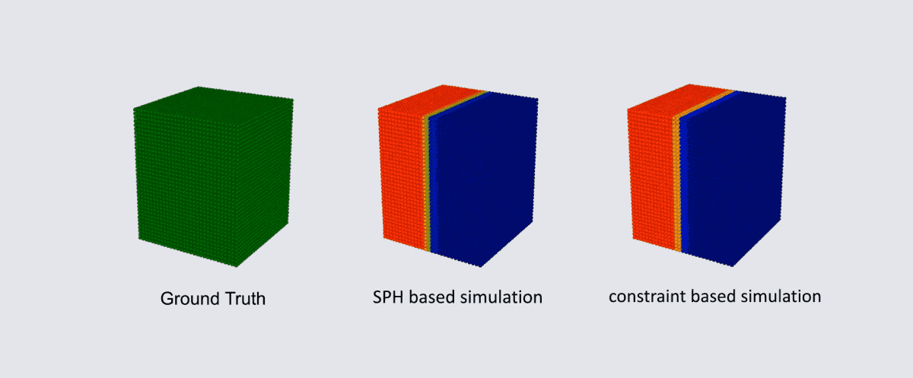

# HeatEquation
## Overview

HeatEquation is a simulation which implements SPH(Smoothed Particle Hydrodynamics)-based and constriant-based heat equation. This simulation is based on CPP-Fluid-Particles[1](#footnote_1).

## Result

## Reference
* <a name="footnote_1">[1]</a> Xiao Zhai. CPP-Fluid-Particles. https://github.com/zhai-xiao/CPP-Fluid-Particles
